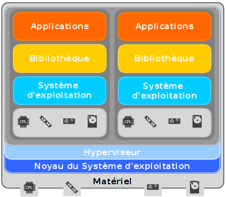
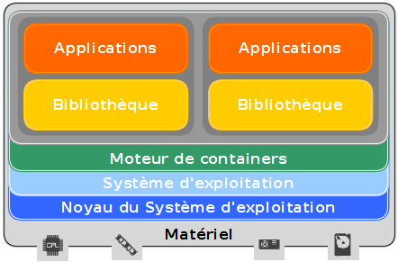
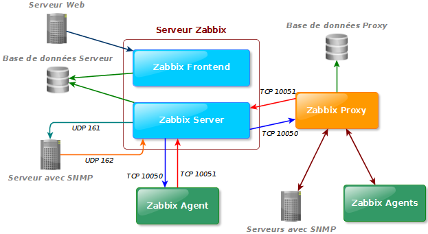
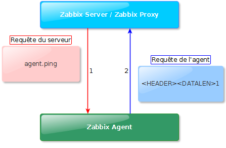
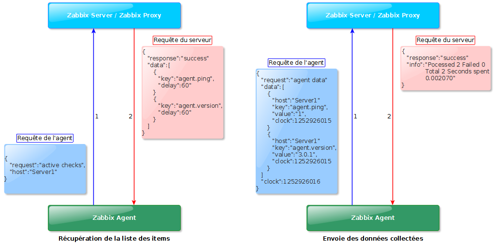
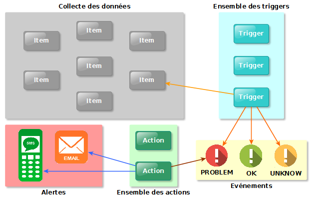

== Virtualisation

La virtualisation est une technique permettant de faire fonctionner plusieurs ordinateurs virtuels à l'aide d'un seul ordinateur ou serveur physique. Cette technologie a l'avatange de limiter l'achat de matériels physiques et de gérer efficacement et plus simplement les environnements virtuels qui sont et seront créés. Il existe plusieurs types de virtualisation.

La plus répandue est la virtualisation complète. Elle utilise un hyperviseur servant de gestionnaire pour les machines virtuelles instanciées et d'isolateur entre elles et le système d'exploitation de la machine physique. Il est possible que certains hyperviseurs comme VMWare ESXi soient installés à la place d'un système d'exploitation, c'est la virtualisation de type I. Le principe de cette technologie est de créer un environnement virtuel en simulant un ordinateur complet. L'hyperviseur alloue les ressources que l'on souhaite attribué au nouvel environnement en fonction des ressources physiques disponibles. Le lien entre les ressources physique et les machines virtuelles est fait grâce à l'hyperviseur.

[[img-sunset]]

<<<

L'avantage de cette technologie est qu'il est possible de créer un environnement virtuel Windows sur un serveur Linux. Cependant, sa principale limitation est son coût en matière de ressources. Par exemple, un utilisateur alloue à un environnement virtuel deux gigaoctets de mémoire. Cette quantité est déduite de la quantité totale disponible matériellement et ce, même si l'environnement n'en utilise que la moitié.

La nouvelle technologie émergente est la _containerisation_. Elle est poussée par la culture DevOps et de nombreux logiciels tels que _LXC_ et surtout _Docker_. Au lieu de simuler un ordinateur complet comme la précédente technique évoquée, le logiciel instancie un environnement en l'isolant avec son propre espace mémoire. Les ressources systèmes et matériel sont partagées entre le kernel de la machine hôte et les "containers". Le principe de cette technologie est de pouvoir créer et détruire rapidement et simplement une application avec toute sa configuration.

[[img-sunset]]

L'avantage est de pouvoir avoir des applications que l'on peut migrer d'une machine à une autre et redéployer rapidement et simplement en cas de panne sur le container. Néanmoins, vu que la technologie utilise le partage des appels système entre l'hôte et les machines virtuelles, il n'est pas possible d'instancier un environnement Windows sur un système d'exploitation Linux. De plus, cette technologie n'est native uniquement dans un environnement Linux. Certains logiciels tels que _Docker_ la développe sous les environnements Windows et MacOS en ajoutant une couche d'abstraction entre le système d'exploitation et les containers.

Ces technologies sont de plus en plus utilisées dans les infrastructures des entreprises, soit à travers la souscription d'une offre de _cloud computing_ ou par le déploiement d'une architecture interne à l'aide de solution tels que _OpenStack_ ou _VMWare_.

<<<

== Zabbix

Zabbix est un ensemble de logiciels permettant la surveillance de l'infrastructure à travers la récupération de mesures de ressources sur chaque environnement souhaité. Il existe trois logiciels pour le fonctionnement de cette solution, serveur, agent et proxy.

=== Architecture Zabbix

Une architecture Zabbix peut être constituée d'au minimun, un serveur auquel on peut greffer deux autres outils, des agents et des proxys. Le serveur est le maitre de l'architecture et les proxys (si utilisés) sont les maîtres d'un certain nombre d'agents. En utilisant tous les outils, il est donc possible d'avoir une architecture distribuée. La transmission des données se fait au moyen de protocoles de communication réseaux.

[[img-sunset]]

<<<

Les outils _server_ et _frontend_ sont le noeud central d'une architecture Zabbix. Ils doivent être couplés à une base de données (_MySQL_, _Oracle_, _PostgreSQL_ ou _SQLite_) pour le stockage des données et à un serveur web. Le serveur Zabbix est le centre de l'architecture Zabbix. Son objectif est de récupèrer et d'analyser les données, de calculer les déclencheurs d'alertes et d'envoyer des notifications (courriel, SMS,...) aux utilisateurs en cas de problèmes détectés. Le serveur Zabbix a la capacité d'utiliser le protocole _SNMP_ afin de récupérer les données souhaitées par un utilisateur.

L'outil _proxy_ sert d'intermédiaire entre le serveur et les agents. Il est installable dans un environnement Linux. Son objectif est de limiter la charge en processus système et en ressource du serveur. Il doit être couplé à une base données pour fonctionner. Il stocke les mesures des différents hôtes dont il est maître et transfert tout le contenu de la base au serveur.
 +
Le logiciel _agent_ de Zabbix est un outil installable sur les environnements Linux, MacOS ou Windows. Il a pour but de récupérer au travers du système d'exploitation les mesures souhaitées et de les transmettre à son noeud supérieur.

Dans le cas de notre infrastructure, nous avons décidé de ne pas mettre en place le mode distribué de l'outil. Seul des agents et un serveur sont utilisés. Cette décision n'est pas définitive mais à l'heure actuelle, son utilisation n'est pas nécessaire puisqu'elle complexifierait notre architecture qui l'est déjà.

=== Communication entre un serveur et un agent

Dans Zabbix, la communication entre un noeud et son maitre se fait par le protocole _HTTP_ et les données transmises sont au format _JSON_. Il existe deux modes d'échange entre les noeuds.
 +
Le premier est le "check" dit passif. Le zabbix serveur envoie une requête de demande de données et l'agent lui répond en transmettant les mesures souhaitées.

[[img-sunset]]

Le second est le "check" actif. Dans ce cas, c'est l'agent qui amorce les échanges. La communication est décomposée en deux étapes distinctes.
 +
Pour commencer, l'agent initialise la connexion avec son maitre en lui demandant la liste de toutes les données qu'il souhaite récupérer. Une fois fait, l'agent démarre sa collecte de données à intervalle fixe pour chacunes des mesures. Une fois que la liste est complétée, il transmet au serveur les résultats.

[[img-sunset]]

L'intêrét de ce dernier check est de limiter la bande passante et les processus système des noeuds maîtres. En effet, dans le premier check, le serveur envoie une requête pour chaque item. A titre d'exemple, dans notre configuration, le serveur devrait gérer plus de deux cents échanges par seconde. Si tel était le cas, notre serveur aurait une charge importante entraînant de possibles problèmes.

=== Système d'alertes

Zabbix propose de générer une alerte lorsque certaines conditions sont remplies. Le principe de la surveillance est de notifier les administrateurs en cas de problème sur l'infrastructure. Ces alertes utilisent trois types de fonctionnalité zabbix. Les _items_ sont des éléments qui définissent les mesures à effectuer. Ensuite, les triggers générent un type événement dépendant d'une valeur collectée à partir d'un item. Enfin, les actions sont l'envoie d'une alerte à des utilisateurs selon le type d'évènement généré par un trigger.

[[img-sunset]]

Les évènements dits "problèmes" possèdent une certaine sévérité, définie par l'utilisateur. Il existe six degrés de gravité dans Zabbix. Dans le cas de ISC France, nous avons fait le choix d'envoyer un courriel et de jouer un son uniquement si la sévérité est élevée. Nous avons été motivés dans ce choix par le nombre élevé de messages reçus sans ce filtre.
