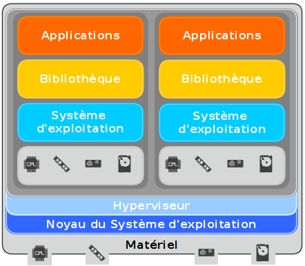
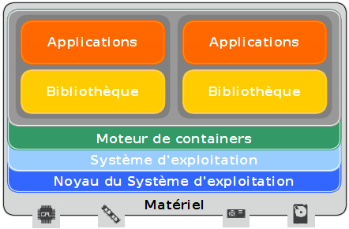

:sectnums:

La virtualisation est une technique permettant de faire fonctionner plusieurs ordinateurs virtuels à l'aide d'un seul ordinateur ou serveur physique. Cette technologie a l'avantage de limiter l'achat de matériels physiques et de gérer efficacement et simplement les environnements virtuels créés. Il existe plusieurs types de virtualisation.

=== Virtualisation classique

La plus répandue est la virtualisation complète. Elle utilise un hyperviseur servant de gestionnaire pour les machines virtuelles instanciées et d'isolateur entre elles et le système d'exploitation de la machine physique. Il est possible que certains hyperviseurs comme VMWare ESXi soient installés à la place d'un système d'exploitation, c'est la virtualisation de type I. Le principe de cette technologie est de créer un environnement virtuel en simulant un ordinateur complet. L'hyperviseur alloue les ressources que l'on souhaite attribuer au nouvel environnement en fonction des ressources physiques disponibles. Le lien entre les ressources physiques et les machines virtuelles est fait grâce à l'hyperviseur.

[[img-sunset]]

<<<

L'avantage de cette technologie est qu'il est possible de créer un environnement virtuel Windows sur un serveur Linux. Cependant, sa principale limitation est son coût en matière de ressources. Par exemple, un utilisateur alloue à un environnement virtuel deux giga-octets de mémoire. Cette quantité est déduite de la quantité totale disponible matériellement et ce, même si l'environnement n'en utilise que la moitié.

=== Containerisation

La nouvelle technologie émergente est la _containerisation_. Elle est poussée par la culture DevOps et de nombreux logiciels tels que _LXC_ et surtout _Docker_. Au lieu de simuler un ordinateur complet comme la précédente technique évoquée, le logiciel instancie un environnement et l'isole, avec son espace mémoire, du reste des processus s'exécutant sur l'hôte. Les ressources systèmes et matériels sont partagées entre le kernel de la machine hôte et les "containers". Cette technique s'appuie sur un ensemble de fonctionnalité du kernel Linux comme _Cgroups_ et _namespaces_. Le principe de cette technologie est de pouvoir créer et détruire rapidement et simplement une application avec toute sa configuration.

[[img-sunset]]

Les avantages de cette technologie sont la simplicité pour migrer une application d'une machine à une autre et la rapidité à redéployer une application en cas de panne sur le container. Néanmoins, vu que la technologie utilise le partage des appels système entre l'hôte et les machines virtuelles, il n'est pas possible d'instancier un environnement Windows sur un système d'exploitation Linux.

<<<

Le logiciel  _Docker_ la développe sous les environnements Windows et MacOS en ajoutant une couche d'abstraction entre le système d'exploitation et les containers. A terme, l'éditeur du logiciel souhaite enlever cette couche pour rendre les containers plus stables et adaptés à son environnement.

Ces technologies sont de plus en plus utilisées dans les infrastructures des entreprises, soit à travers la souscription d'une offre de _cloud computing_ ou par le déploiement d'une architecture interne à l'aide de solutions telles que _OpenStack_ ou _VMWare_.

:!sectnums:
