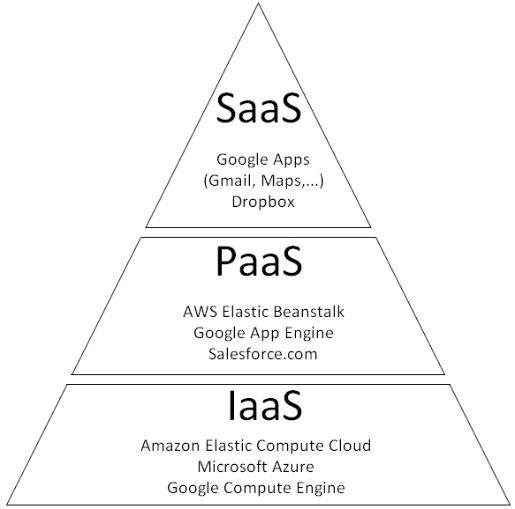
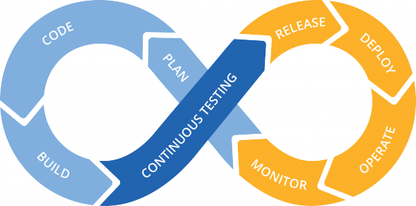

Ansible::
est un logiciel open source permettant la configuration et la gestion des ordinateurs à distance.

Cloud Computing::
est un paradigme récent avec pour but de centraliser et d'utiliser au maximum la puissance de calcul de chaque serveur. L'intêrét est de limiter les dépenses en matériel et en ressource électrique. De nombreuses entreprise fournissent à leurs clients différents services issue de ce paradigme. Les trois catégories de services sont _Infrastructure As A Service_ (IaaS) -les clients souscrivent un accès à un parc informatique virtualisé-, _Platforme As A Service_ (PaaS) -les clients souscrivent à des matériels virtuels leur offrant un controle pour installer des applications- et _Software As a Service_ (SaaS) -les clients souscrivent à des applications.

[[img-sunset]]

Containerisation::
est une sous-catégorie de la virtualisation. C'est le fait d'instancier uniquement le système d'exploitation de chaque environnement virtuel souhaité.

Continuous Delivery::
est une approche de l'ingénierie logiciel visant à assurer le fonctionnement d'une application entre chaque version de celle-ci. Des cycles courts sont étudiés pour corriger le plus rapidement les bogues possibles.

<<<

DevOps::
est un mouvement informatique visant à donner une cohésion entre chaque les équipes de développeur et les équipes d'administrateur au sein d'une même entreprise.

[[img-sunset]]

Docker::
est un logiciel open source permettant de créer, gérer et détruire des environnements virtuels de type container.

Entreprise services du numérique (ESN)::
Anciennement société de services en ingénierie informatique (SSII), est une société de service proposant ces services à ces clients pour des missions d'ordre informatique.

JavaScript Object Notation (JSON)::
est un format de données textuelle issue du langage JavaScript

Paradigme::
est une vision qui classe des notions informatiques par leur solution.

PowerShell::
est un logiciel _Microsoft_ intégrant une interface en ligne de commande, composant permettant d'interpréter les commandes d'un utilisateur, et langage de script orienté objet PowerShell.

Openstack::
est un ensemble de logiciel open source permettant de déployer des architectures informatiques à l'aide de la virtualisation.

SNMP (Simple Network Management Protocol)::
est un protocole réseau permettant aux administrateurs réseaux de gérer et monitorer tout type de matériel réseau.

SSH (Secure Shell)::
est un protocole de communication sécurisée basé sur l'utilisation du couple clef privée/clef publique pour chiffrer et déchiffrer les communications entre deux communicants. L'échange de clef publique avant l'intéraction est obligatoire.

Virtualisation::
est le fait de faire fonctionner plusieurs ordinateurs virtuels sur un seul ordinateur physique.

WinRM::
est un protocole de gestion à distance, propriété de _Microsoft_. Il a pour but de permettre un échange entre deux matériels implémentant ce protocole.

YAML (YAML Ain't Markup Langare)::
est un format représentant des données par sérialisation comme le format_XML_.

Zabbix::
est un logiciel open source permettant la surveillance et la mesure de l'ensemble des matériels réseaux compatibles se trouvant dans une infrastructure.
