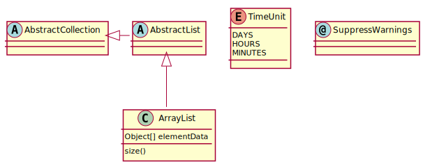
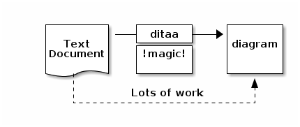
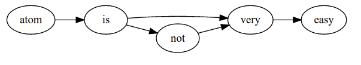

== Asciidoctor

Asciidoctor est une suite d'outils permettant de convertir des documents écrits au format Asciidoc en HTML5 (documents ou slide avec Reveal.js), DocBook, PDF et d'autres formats.

== Le contenu avant le rendu

La particularité de l'Asciidoc est qu'il permet de se concentrer sur le contenu des documents, écrit sous la forme d'un simple fichier texte. C'est ensuite avec les outils Asciidoctor que l'on va générer le rendu final du document (HTML5 pour la figure <<F1, Figure 1>>) via une feuille de style (CSS pour le format HTML ou YAML pour le format PDF).

[[F1]]
image::http://asciidoctor.org/images/zen-screenshot.png[caption="Figure 1: ", title="Asciidoc - Le contenu avant le rendu", alt="Asciidoc - Le contenu avant le rendu", link="http://asciidoctor.org/"]

== Tableau des outils Asciidoctor

[NOTE.speaker]
Ceci est une liste des outils qui sont (ou peuvent être) utilisés au sein de l'entreprise.

[cols="3", options="header"]
|===
|Outil
|Utilité / Porté
|Lien

|asciidoctor
|
|https://github.com/asciidoctor/asciidoctor[Lien GitHub] +
http://asciidoctor.org/[Site Web]

|asciidoctor-intellij-plugin
|Bureautique / Plugin
|https://github.com/asciidoctor/asciidoctor-intellij-plugin[Lien GitHub] +
https://plugins.jetbrains.com/plugin/7391[Lien JetBrains]

|asciidoctor-chrome-extension
|Bureautique / Plugin
|https://github.com/asciidoctor/asciidoctor-chrome-extension[Lien GitHub] +
https://chrome.google.com/webstore/detail/asciidoctorjs-live-previe/iaalpfgpbocpdfblpnhhgllgbdbchmia[Liens Google Chrome]

|asciidoctor-pdf
|Bureautique / Utilisé par la PIC / Transparent pour l'utilisateur
|https://github.com/asciidoctor/asciidoctor-pdf[Lien GitHub]

|asciidoctor-reveal.js
|Bureautique / Utilisé par la PIC / Transparent pour l'utilisateur
|https://github.com/asciidoctor/asciidoctor-reveal.js[Lien GitHub]

|docker-asciidoctor
|Développement / Utilisé par la PIC / Transparent pour l'utilisateur
|https://github.com/asciidoctor/docker-asciidoctor[Lien GitHub]

|asciidoctor-stylesheet-factory
|Développement / Design / Utilisé par la PIC / Transparent pour l'utilisateur
|https://github.com/asciidoctor/asciidoctor-stylesheet-factory[Lien GitHub]
|===

== AsciidocFX

AsciiDoc FX est un éditeur de texte permettant de générer, à partir du language Asccidoc, des fichiers PDF, Epub, Mobi et HMTL sous forme de livre, de document ou de slide.

image::http://asciidocfx.com/images/asciidocfx.png[caption="Figure 2: ", title="AsciiDoc FX", alt="AsciiDoc FX", width="500", link="http://asciidocfx.com/", align="center"]

[WARNING.speaker]
====
Lors de l'utilisation de ce logiciel, il peut arriver que le fichier apparaît vide lorsqu'on l'ouvre. Ors ce n'est pas le cas avec un éditeur de texte simple. De plus, cela peut engendrer des problèmes de sauvegardes.

C'est pour cette raison qu'il a été décidé de présenter un deuxième éditeur permettant pré-rendu du document Asciidoc et l'utilisation d'extensions.
====

== Atom

Atom est un éditeur de texte qui peut être customisé via l'installation de packages.
Il permet ainsi d'écrire de l'Asciidoc tout en ayant une coloration syntaxique et un pré-rendu du document Asciidoc.
De plus, d'autres extensions permettent de générer des diagrammes "basiques" (graphviz) et des diagrammes uml (plantuml).

image::https://i.github-camo.com/95dc5ec59ce61a91d705f7cea84646ae11ed98d6/68747470733a2f2f7261772e67697468756275736572636f6e74656e742e636f6d2f616e74686f6e6e792f6173636969646f632d707265766965772f6d61737465722f73637265656e73686f742e6a7067[width="500", align="center", link="https://atom.io/"]

== Les extensions

[IMPORTANT.speaker]
====
Toutes les extensions présentées ci-dessous ne sont pas forcément compatibles avec Atom ou AsciidocFx.
Par exemple, PlantUml est géré par les deux applications (via un package pour Atom), sauf que la syntaxe pour déclarer le bloc UML diffère.
[TIP]
Pour cette raison, à chaque présentation des extensions, cette annotation indiquera les compatibilités possibles.
====

== Les extensions - PlantUML

.Voici comment s`'écrit un schéma UML avec PlantUml:
....
abstract class AbstractList
abstract AbstractCollection

AbstractCollection <|- AbstractList
AbstractList <|-- ArrayList

class ArrayList {
  Object[] elementData
  size()
}

enum TimeUnit {
  DAYS
  HOURS
  MINUTES
}
annotation SuppressWarnings
....

[TIP.speaker]
====
Atom:: Il vous faudra installer le package suivant:
* plantuml-viewer - https://atom.io/packages/plantuml-viewer

+
.Vous devrez créer un fichier avec l'extension .puml et déclarer le bloc UML de la manière suivante:
....
@startuml
  *Votre uml ecrit en langage plantuml*
@enduml
....

AsciidocFx:: Aucune installation nécessaire.
+
.Vous devrez créer un fichier avec l'extension .adoc et déclarer le bloc UML de la manière suivante:
....
[uml,file="uml-example.png"]
--
  *Votre uml ecrit en langage plantuml*
--
....
====

== Les extensions - Ditaa

.Voici comment s`'écrit un schèma Ditaa:
.....
    +--------+   +-------+    +-------+
    |        |---+ ditaa +--->|       |
    |  Text  |   +-------+    |diagram|
    |Document|   |!magic!|    |       |
    |     {d}|   |       |    |       |
    +---+----+   +-------+    +-------+
        :                         ^
        |       Lots of work      |
        +-------------------------+
.....

[TIP.speaker]
====
Atom:: Aucun package n'existe à ce jour.

AsciidocFx:: Aucune installation nécessaire.
+
.Vous devrez créer un fichier avec l'extension .adoc et déclarer le bloc Ditaa de la manière suivante:
....
[ditaa,file="ditaa-example.png"]
--
  *Votre ditaa écrit en ascii*
--
....
====

== Les extensions - Graphviz

....
digraph{
rankdir="LR"
atom->is->very->easy
is->not->very
}
....

[TIP.speaker]
====
Atom:: Il vous faudra installer les packages suivants:
* graphviz-preview - https://atom.io/packages/graphviz-preview
* language-dot - https://atom.io/packages/language-dot

+
.Vous devrez créer un fichier avec l'extension .dot et déclarer le bloc graphviz de la manière suivante:
....
digraph{
  *Votre graphviz écrit en langage dot*
}
....

[IMPORTANT]
Gaphviz ne permet pas de sauver directement l'image.

AsciidocFx:: Bien que graphviz soit nécessaire pour plantuml.
Il n'est pas possible de créer un schéma graphviz.
====
